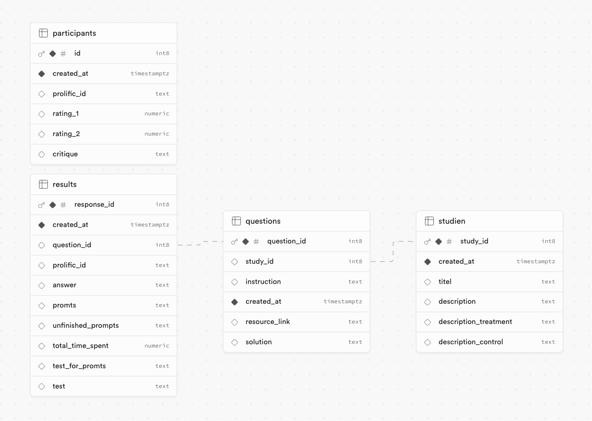

### 1. Clone the Repository

Start by cloning the repository where the Next.js project with Supabase integration is hosted:

```bash
git clone <repository-url>
cd <repository-name>
```

Replace `<repository-url>` with the URL of your repository and `<repository-name>` with the directory name it clones into.

### 2. Install Dependencies

Navigate to the project directory and install the necessary dependencies:

```bash
npm install
```


## Setting Up Supabase

This Next.js app integrates Supabase as the backend database and API solution. Follow the steps below to set up Supabase for your project:

### Register a Supabase Account

1. **Visit Supabase:** Go to [Supabase](https://supabase.com) and sign up for a new account or log in if you already have an account.

### Create a New Supabase Project

1. **Create a New Project:**
   - Once logged in, click on the "New Project" button in the Supabase dashboard.
   - Fill in the necessary details, including the project name, password, and region.
   - Click "Create New Project" to initialize your Supabase project.

### Recreate Database Schema

To recreate the database schema used in this project, follow the steps below:

#### 1. Access the Supabase SQL Editor

1. **Navigate to the SQL Editor:**
   - In your Supabase project dashboard, click on "SQL Editor" from the left-hand menu.

    Recreate the following database schema:

    Below is the visual representation of the database schema for this project:

    

#### 3. Verify the Schema

1. **Check Your Tables:**
   - Go to the "Table Editor" section in the Supabase dashboard to verify that the tables have been created correctly according to the schema.

### Configure Environment Variables

1. **Retrieve Supabase Credentials:**
   - Navigate to the "Settings" and then "API" section within your Supabase project.
   - Copy the "Project URL" and "anon/public" API key.

2. **Set Up Environment Variables:**
   - Create a new `.env.local` file in the root of your Next.js project.
   - Add the following lines to your `.env.local` file:

   ```plaintext
   NEXT_PUBLIC_SUPABASE_URL=<your-supabase-url>
   NEXT_PUBLIC_SUPABASE_ANON_KEY=<your-supabase-anon-key>
   ```

   Replace `<your-supabase-url>` and `<your-supabase-anon-key>` with the credentials you copied from the Supabase dashboard.

### Final Steps

1. **Run Your Application:**
   - Start your development server with the following command:

   ```bash
   npm run dev
   ```

2. **Access Your App:**
   - Open [http://localhost:3000](http://localhost:3000) in your web browser to view the application.


### Register an OpenAI Account

1. **Visit OpenAI:** Go to [OpenAI](https://openai.com) and sign up for a new account or log in if you already have an account.

### Create an OpenAI API Key

1. **Access API Keys:**
   - Once logged in, navigate to the API section of your OpenAI account dashboard.
   - Create a new API key by following the instructions provided.
   - Copy the generated API key for use in your application.

### Configure Environment Variables

1. **Retrieve Supabase Credentials:**
   - Navigate to the "Settings" and then "API" section within your Supabase project.
   - Copy the "Project URL" and "anon/public" API key.

2. **Set Up Environment Variables:**
   - Create a new `.env.local` file in the root of your Next.js project.
   - Add the following lines to your `.env.local` file:

   ```plaintext
   NEXT_PUBLIC_SUPABASE_URL=<your-supabase-url>
   NEXT_PUBLIC_SUPABASE_ANON_KEY=<your-supabase-anon-key>
   NEXT_PUBLIC_OPENAI_API_KEY=<your-openai-api-key>
   ```

   Replace `<your-supabase-url>`, `<your-supabase-anon-key>`, and `<your-openai-api-key>` with the credentials you copied from Supabase and OpenAI.

### Final Steps

1. **Run Your Application:**
   - Start your development server with the following command:

   ```bash
   npm run dev
   ```

2. **Access Your App:**
   - Open [http://localhost:3000](http://localhost:3000) in your web browser to view the application.


## Create new Study


To create tasks and studies use MDX/Markdown. On the instructions Page the syntax is extendend by $$$. By seperating your instruction set by these $$$ you seperate the resuting component in widgets. This might be useful to better explain the user certain features as well as keep the user from skipping the entire Instruction page.

To insert images, upload them on supabase storage and copy the image url in the markdown entry accordingly.


## Deploy on Vercel

The easiest way to deploy your Next.js app is to use the [Vercel Platform](https://vercel.com/new?utm_medium=default-template&filter=next.js&utm_source=create-next-app&utm_campaign=create-next-app-readme) from the creators of Next.js.

Check out our [Next.js deployment documentation](https://nextjs.org/docs/deployment) for more details.


## Learn More

To learn more about Next.js, Supabase, and OpenAI, take a look at the following resources:

### Next.js

- [Next.js Documentation](https://nextjs.org/docs) - Learn about Next.js features and API.
- [Learn Next.js](https://nextjs.org/learn) - An interactive Next.js tutorial.
- [Next.js GitHub Repository](https://github.com/vercel/next.js/) - Your feedback and contributions are welcome!

### Supabase

- [Supabase Documentation](https://supabase.com/docs) - Explore detailed guides and API references for Supabase.
- [Supabase GitHub Repository](https://github.com/supabase/supabase) - Check out the source code, open issues, and contribute to the project.
- [Supabase Discord Community](https://discord.com/invite/supabase) - Join the community for discussions, questions, and networking with other developers.

### OpenAI

- [OpenAI API Documentation](https://beta.openai.com/docs/) - Discover how to use OpenAI’s API and explore its features.
- [OpenAI GitHub Repository](https://github.com/openai) - View various projects and libraries developed by OpenAI.
- [OpenAI Community Forum](https://community.openai.com/) - Engage in discussions, share ideas, and ask questions about OpenAI developments.
